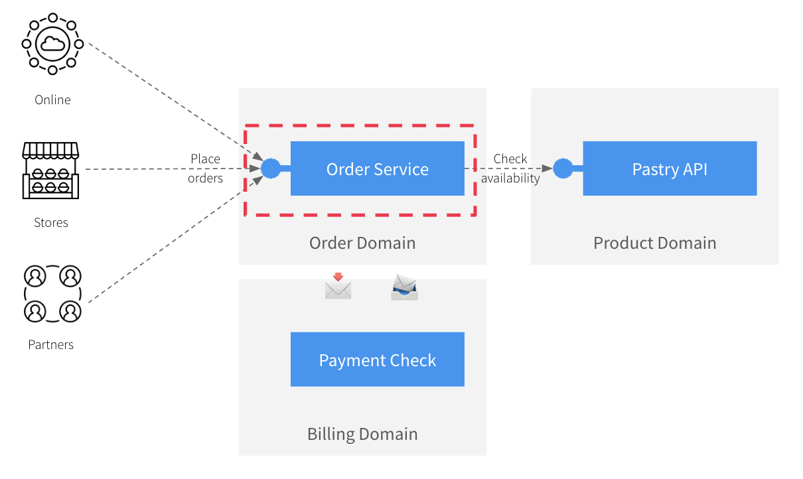

# Step 2: Exploring the app

This fictional application we're working on is a typical `Order Service` that can allow online, physical stores, or even
partners to place orders for our freshly-baked pastries! For that, the `Order Service` is exposing a REST API to its consumers
but also relies on an existing API we have [introduced in a previous post](https://medium.com/@lbroudoux/different-levels-of-api-contract-testing-with-microcks-ccc0847f8c97) 😉

The `Order Service` application has been designed around 5 main components that are directly mapped to Quarkus components and classes:
* The [`OrderResource`](src/main/java/org/acme/order/api/OrderResource.java) (or `OrderController` in schema below) is responsible for exposing an `Order API` to the outer world.
* The [`OrderService`](src/main/java/org/acme/order/service/OrderService.java) is responsible for implementing the business logic around the creation of orders.
* The [`PastryAPIClient`](src/main/java/org/acme/order/client/PastryAPIClient.java) is responsible for calling the `Pastry API` in *Product Domain* and get details or list of pastries.
* The [`OrderEventPublisher`](src/main/java/org/acme/order/service/OrderEventPublisher.java) is responsible for publishing a message on a Kafka topic when a new [`Order`](src/main/java/org/acme/order/service/model/Order.java) is created.
* The [`OrderEventListener`](src/main/java/org/acme/order/service/OrderEventListener.java) is responsible for consuming message from a Kafka topic when an [`Order`](src/main/java/org/acme/order/service/model/Order.java) has been reviewed.

Of course, this is a very naive vision of a real-life system, and as such an application would certainly pull out much more
dependencies (like a `Payment Service`, a `Customer Service`, a `Shipping Service`, and much more) and offer more complex API.

However, this situation is complex enough to highlight the two problems we're addressing:
1) How to **efficiently set up a development environment** that depends on third-party API like the Pastry API?
    - You certainly want to avoid cloning this component repository and trying to figure out how to launch and configure it accordingly.
    - As a developer, developing your own mock of this service makes you also lose time and risk drifting from initial intent,
2) How to **efficiently validate the conformance** of the `Order API` and `Order Events` against business expectations and API contracts?
    - Besides the core business logic, you might want to validate the network and protocol serialization layers as well as the respect of semantics.

## Business logic

This application must implement basic flows:
* When creating a new [`Order`](src/main/java/org/acme/order/service/model/Order.java), the service must check that the products are available before creating and persisting an order. Otherwise, order cannot be placed.
* When the [`Order`](src/main/java/org/acme/order/service/model/Order.java) is actually created, the service must also publish an [`OrderEvent`](src/main/java/org/acme/order/service/model/OrderEvent.java) to a specific Kafka topic to propagate this information to other systems that will review the events,
* When the [`OrderEvent`](src/main/java/org/acme/order/service/model/OrderEvent.java) has been reviewed, a new message is published on another Kafka topic. The [`OrderEventListener`](src/main/java/org/acme/order/service/OrderEventListener.java) must capture-it and update the corresponding [`Order`](src/main/java/org/acme/order/service/model/Order.java) status using the service.

## Flows specifications

All the interactions are specified using API contracts:
* The Order API is specified using the [`order-service-openapi.yaml`](src/main/resources/order-service-openapi.yaml) OpenAPI specification
* The Pastry API is specified using the [`apipastries-openapi.yaml`](src/test/resources/third-parties/apipastries-openapi.yaml) OpenAPI specification
* The Order Events are specified using the [`order-events-asyncapi.yaml`](src/main/resources/order-events-asyncapi.yaml) AsyncAPI specification

Those specifications will help us for two things:
1) They will be used to provide simulations (or mocks) of third-parties systems - typically the Pastry API provider and the reviewer system that provides updates on `OrderEvents`
2) They will be used to allow checking the conformance of the provided `Order API` and the published `Order Event` on order creation.

### 
[Next](step-3-local-development-experience.md)